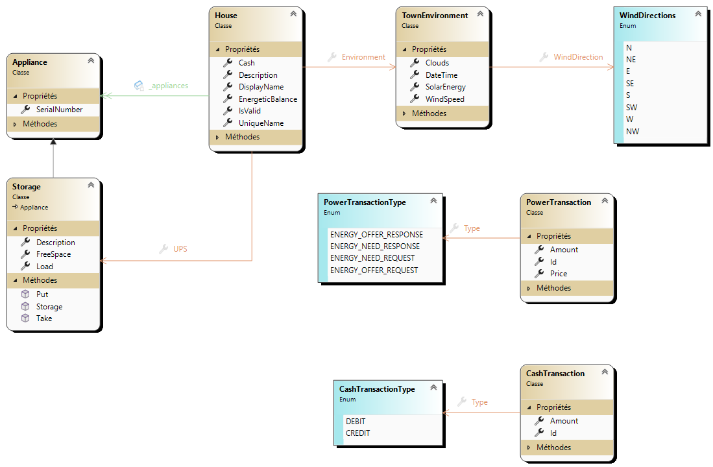
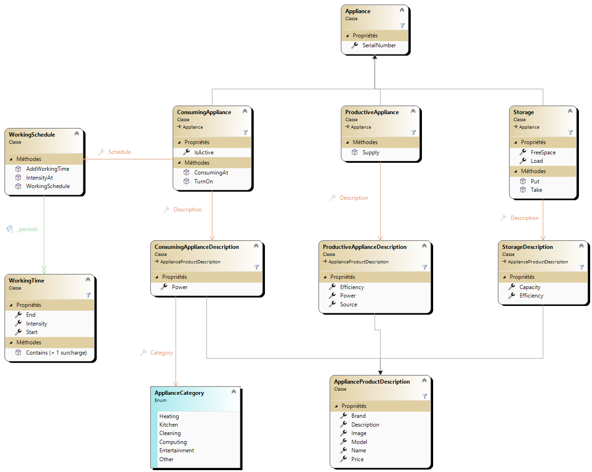

# Powercher

Le projet fil rouge qui accompagne le cours ICT-321 est "PowerCher", une simulation de distribution d'énergie électrique dans un village.

Chaque élève a une parcelle sur laquelle il a une maison.

Chaque maison est reliée au réseau électrique national (PowerDeal), un très gros stockage.

"Mère Nature" est un service à disposition de tous, qui fournit :
- L'heure courante
- La force et la direction du vent
- La couverture nuageuse et le taux d'ensoleillement (100% = midi, aucun nuage, 21 juin)

Chaque maison "existe" sous forme d'une application winforms qui tourne sur le poste de son propriétaire.

Chaque maison a un budget de fonctionnement pour s’équiper en divers matériels :
- pompe à chaleur
- four
- lave-linge
- sèche-cheveux
- télé
- frigo
- bornes de recharges
  - téléphone
  - voiture
- réveil
- radio
- plaque de cuisson
- lave-vaisselle
- ordinateur
- ...

Et chaque élément a un coût et une consommation...

| appareil          | coût | consommation en watt |
|-------------------|------|----------------------|
| four à raclette A | 100  | 1500                 |
| lave-linge     A  | 500  | 1000                 |
| ...               |      |                      |

## Architecture du système

Une maison consiste en une application Winforms qui s'exécute sur le PC d'un élève.  
Chaque Maison contient des appareils producteur d'énergie (P), de stockage d'énergie (S) et des consommateurs (C).  
Chaque maison est équipée d'un stockage d'entrée particulier: un bloc de [supercondensateurs](https://fr.wikipedia.org/wiki/Supercondensateur#:~:text=Un%20supercondensateur%20est%20un%20condensateur,et%20les%20condensateurs%20%C3%A9lectrolytiques%20classiques.) qui sert de tampon (B). La maison "pète un câble" si elle demande plus d'énergie au supercondo qu'il n'en possède.

Tous les nœuds du système communiquent au moyen du protocole MQTT en passant par un agent (A) qui prend en charge l'échange des messages avec broker MQTT.

Mère Nature fonctionne en émission uniquement. Elle diffuse ses informations à intervalles régulier.

PowerWatch est un point central de monitoring de l'ensemble du système. Il interroge chaque maison à intervalles réguliers et il regroupe les réponses reçues dans une interface graphique.

PowerDeal est le [GRD](https://fr.wikipedia.org/wiki/Gestionnaire_de_r%C3%A9seau_de_distribution_d%27%C3%A9nergie) (gestionnaire de réseau de distribution) du système. C'est auprès de lui que les maisons viennent chercher l'énergie nécessaire à leur fonctionnement qu'elles n'ont pas pu produire elle-même.   

Pendant le développement, chaque développeur fait tourner PowerDeal et Mère Nature sur son PC, en s'appuyant sur un broker MQTT local qui tourne dans un conteneur Docker (fourni)

## Modèle de données

La base du modèle de données se présente ainsi:

Une maison stocke les informations reçues de mère nature dans un objet de type `TownEnvironment`.  
Une maison possède au minimum un objet de type `Storage`, il s'agit du supercondensateur.  
Le champ `UniqueName` de la maison est un identifiant qui permet de distinguer chaque maison qui communique dans le système.  

En ce qui concerne les appareils électriques (appliances), le modèle fourni se présente ainsi:

La modélisation d'un appareil physique consiste toujours en deux parties distinctes :
1. La description générique du produit. Par exemple : "aspirateur Hoover de 50W, ..."
2. La partie concrète, qui représente un appareil parmi les milliers d'exemplaires du produit qui ont été fabriqués.

Remarquez que le lien entre ces deux parties se fait par agrégation : un objet de type `Storage` **a** une référence sur un objet de type `StorageDescription`.  

Observez également dans ce diagramme les relations d'héritage entre les entités:
- Une `ProductiveAppliance` **est** une `Appliance`
- Une `StorageDescription` **est** une `ApplianceProductDescription` qui décrit les caractéristiques spécifiques aux appareils qui stockent l'énergie : la capacité et l'efficacité.

L'efficacité est le rapport entre la puissance ou l'énergie qui rentre dans l'appareil et celle qui ressort. Exemple : un panneau solaire qui a une efficacité de 30 % reçoit 500 kW d'énergie solaire, mais il n'en ressort que 150 kW d'énergie électrique (500 * 30 / 100).

## Projet

Chaque maison dispose d'une Mediathèque contenant des fichiers audio et vidéo.

Le contenu de chaque mediathèque est partagé avec tout le village par "BitRuisseau".

### Etape 1 
La classe définit, valide et publie le protocole BitRuisseau, qui permet à une médiathèque de:
- Demander sur le réseau (broadcast) quels sont les médiathèques qui sont opérationnelles
- S'annoncer opérationnelle
- Demander son catalogue à une médiathèque
- Publier son catalogue
- Demander un fragment de media à une mediatheque
- Fournir un fragment de media à une mediatheque

Le protocole doit être conçu pour supporter des évolutions.

### Etape 2

Définir l'UI du mediaplayer (maquette(s))  
Définir l'UX (User Stories)

Les fonctionnalités minimales à couvrir:
- Afficher le contenu de la mediathèque (dossier local)
- Afficher la liste des contenus disponibles dans la communauté

### Etape 3 

- Implémentation des catalogues

### Etape 4

- Définir l'UI/UX de l'importation d'un contenu externe dans sa mediatheque
- Implémenter

